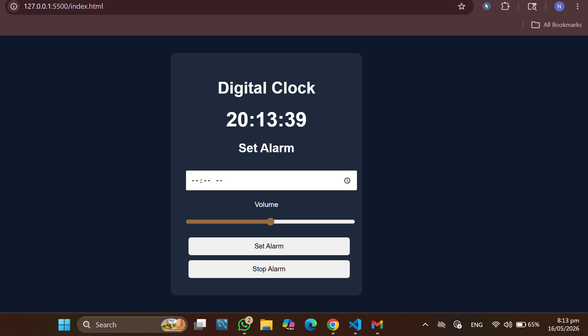

#  Digital Clock & Alarm App

A responsive Digital Clock and Alarm web application built using HTML, CSS, and JavaScript.

---

## Features
- Live digital clock
- Set alarm functionality
- Volume control for alarm sound
- Stop alarm button
- Fully responsive design (mobile + desktop)

---

##  Technologies Used
- HTML5
- CSS3
- JavaScript (Vanilla JS)

---

##  Preview

---

##  Live Demo

https://digital-clock-19d5f5.netlify.app/

---

##  Project Access

This project is deployed and can be accessed online:

🔗 Live Website: https://digital-clock-19d5f5.netlify.app/

No installation required — just open and use it.

---

## 👨‍💻 Author
Nida Riaz